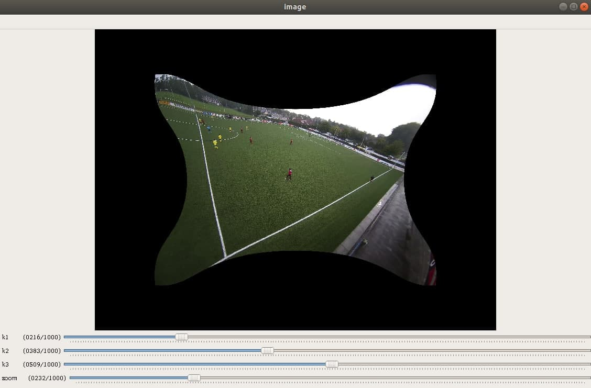
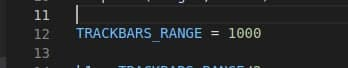

# Python-opencv implementetion of 3-parameter camera calibration

## It can be used for manual removing the radial distortion on fisheye images

### You can increase the range of trackbars values by changing the TRACKBARS_RANGE parameter

